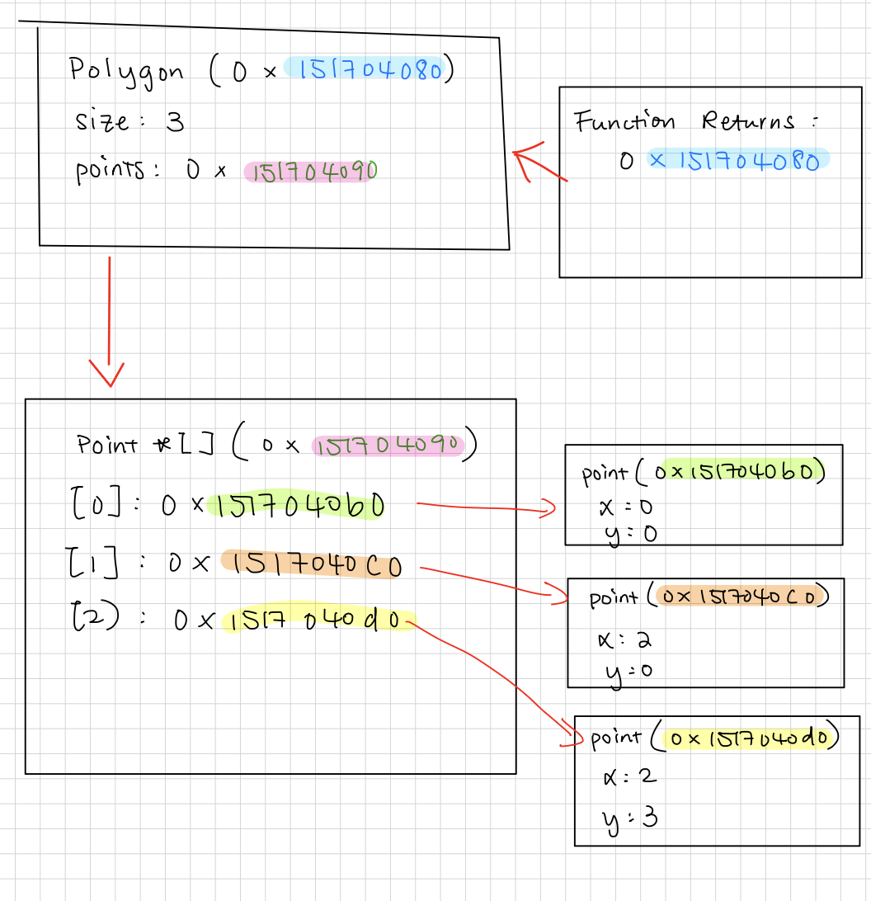

# Homework - C Practice Report

Completely answer the report questions below. Make sure to double check the final version to make sure it is easily readable on your github repository. 


1. What is the difference between a standard numeric type (int, float, double) and a pointer?
   
  int holds whole numbers, float holds single precision decimals numbers, and double holds double precision decimals numbers. They all store 
  actual value. Pointer stores the memory address of another variable, and it doesn't store actual value but location in memory.

2. In your test file, we had the following code:
    
    ```c
    int* arr = create_array_of_ints_fib(5);
    int expected[] = {1, 1, 2, 3, 5};
    ```
    Later in the code we only `free(arr)` but not expected. Why is this? What is the difference in where they are stored in memory?


   `free(arr)` points to memory, and that memory won't be cleaned up automatically. The expected is just a regular local variable that it 
   gets cleaned up automatically.

3. What is the difference between the heap and stack when related to memory allocation and management?

   The stack takes care of memory on its own when it comes to local variables and function calls. The heap needs to be managed memory manually.

4. Take the following code:
   ```c
   #include <stdio.h>
   #include <stdlib.h>

   typedef struct {
     int x, y;
   } Point;

   Point * new_point(int x, int y) {
     Point pt = {x, y};
     return &pt;
   }

   int main() {
      Point* point = new_point(10, 10);
      printf("x: %d, y: %d", point->x, point->y);
      return 0;
   }
   ```
   Would the code run correctly? Even if it does compile, what would be some potential runtime issues? After answering your thoughts, put the output of a run below (you may need to run it a few times).

   I don't think so. It is returning a pointer to memory that will be invalid once the function ends.

   ```text
   q4test.c:10:14: warning: address of stack memory associated with local variable 'pt' returned [-Wreturn-stack-address]
   10 |      return &pt;
      |              ^~
   1 warning generated.
   ```

   Fix the code in the following block:
   ```c
   #include <stdio.h>
   #include <stdlib.h>

   typedef struct {
   int x, y;
   } Point;

   Point * new_point(int x, int y) {
   Point *pt = malloc(sizeof(Point));  
   if (pt != NULL) {                   
      pt->x = x;
      pt->y = y;
   }
   return pt;                          
   }

   int main() {
      Point* point = new_point(10, 10);
      if (point != NULL) {             
      printf("x: %d, y: %d\n", point->x, point->y);
      free(point);                     
      }
      return 0;
   }
   ```

5. When you use `malloc`, where are you storing the information?

   It is stored in the heap.

6. Speaking about `malloc` and `calloc`, what is the difference between the two (you may need to research it!)?

   malloc() allocates a block of memory of the requested size in bytes and returns a pointer to the start of that block. The allocated memory is not initialized, so reading from it before storing values results in undefined behavior, which typically appears as random or garbage values.

   calloc() allocates memory and also initializes every byte to zero. Reading from this allocated memory before storing values will return zeros, since the memory has already been cleared during allocation.

7. What are some common built in libraries used for C, list at least 3 and explain each one in your own words. Name a few (at least 3) functions in those libraries (hint: we used two of the most common ones in this assignment. There are many resources online that tell you functions in each library - you need to include at least 1 reference, but ideally for every library, you should have a reference to it)?
   - Example: stdlib.h - provides functions for general-purpose operations including
              memory management and random numbers [1].
     - void * malloc(size_t) - allocates memory specified in size on the heap and returns a pointer to that location
     - void * calloc(size_t num_elements, size_t element_size) - contiguous allocation for allocating arrays with the default value of 0. Slower than malloc. 
     - int rand(void) - returns a random integer between 0 and RAND_MAX. Seed should be set before hand. 
   1. stdio.h – used for input, output and file handling operations
      * printf() – prints formatted output to the console
      * scanf() – reads formatted input from the console
      * fopen() – opens a file for reading or writing
   
   2. string.h – deals with string and memory manipulation
      * strlen() – returns the length of a string
      * strcpy() – copies one string into another
      * strcmp() – compares two strings
 
   3. math.h – provides math functions and constants
      * sqrt() – finds the square root of a number
      * pow() – raises a number to a power
      * sin() – gets the sine of an angle
 

8. Looking at the struct Point and Polygon, we have a mix of values on the heap, and we make ample use of pointers. Take a moment to draw out how you think that looks after `create_triangle(2,3)` is called (see an example below). The important part of the drawing it to see that not everything is stored together in memory, but in different locations! Store the image file in your github repo and link it here. You can use any program to draw it such as [drawIO](https://app.diagrams.net/), or even draw it by hand and take a picture of it. 




## Technical Interview Practice Questions
For both these questions, are you are free to use what you did as the last section on the team activities/answered as a group, or you can use a different question.

1. Select one technical interview question (this module or previous) from the [technical interview list](https://github.com/CS5008-khoury/Resources/blob/main/TechInterviewQuestions.md) below and answer it in a few sentences. You can use any resource you like to answer the question.


Explain how Merge Sort works and what is its time and space complexity?


Merge Sort is a divide-and-conquer algorithm that splits an array into halves, recursively sorts each half, and then merges them back in sorted order. It keeps dividing until each subarray has one element, which is trivially sorted. During the merge step, it compares elements from each half and builds a sorted array. Its time complexity is O(n log n) and space complexity is O(n).


2. Select one coding question (this module or previous) from the [coding practice repository](https://github.com/CS5008-khoury/Resources/blob/main/LeetCodePractice.md) and include a c file with that code with your submission. Make sure to add comments on what you learned, and if you compared your solution with others. 


The code is saved in file 'leetcode.c'. 
link to the problem: https://leetcode.com/problems/merge-two-sorted-lists/?envType=list
What I learned:
1. Working with pointers in C takes a lot of care. I had to move them forward without breaking the links, otherwise I lose track of the list.
2. Using interative rather than recursive is better for memory. 
3. Edge cases like empty lists aren’t a big deal here, since the while loop condition already takes care of them.

I didn't compare my code to others.

## Deeper Thinking
In Java and Python, do you think new objects are stored on the stack or the heap? Feel free to work through your thoughts as to why it would be better to store them on the stack or heap. You should consider pass by reference, and how that is similar to pointer in your answer. Feel free to use resources, but make sure to cite them, and include the citation below using ACM format. You will note LLMs are not valid references, but they can give you directions to valid references. Make sure to use your own words. 

Answer here using a paragraph (not just bullet points). 

To my understanding, in both Java and Python, new objects are stored in the heap. The stack is mostly for temporary stuff like function calls and local variables. Anything on the stack disappears when the function ends, so objects wouldn’t last long there. The heap lets objects stick around even after a function is done. That way, different parts of the program can share and use the same objects. In Java, a variable just holds a reference to the object in the heap, and I took it very similar to a pointer in C. Passing that reference to a function means the function can work with the same object without making a copy. Python works the same way. Everything lives in a heap managed by the interpreter, and variables just point to those objects. Using the heap makes it easy to keep objects around, share them, and manage memory safely.


## References
Add any references you use here. Use ACM style formatting, adding to the numbers as you add the reference. 

1. cppreference.com Contributors. 2025. Standard library header <stdlib.h>. cppreference.com. Retrieved May 1, 2025 from https://en.cppreference.com/w/c/header/stdlib

2. Difference Between malloc() and calloc() with Examples 2025. Retrived Sept 19, 2025 from https://www.geeksforgeeks.org/c/difference-between-malloc-and-calloc-with-examples/
   
3. C stdio Functions. Retrived Sept 19, 2025 from https://www.w3schools.com/c/c_ref_stdio.php
   
4. Merge Sort 2025. Retrived Sept 19, 2025 from https://www.geeksforgeeks.org/dsa/merge-sort/
   

## Resource/Help: Linking to images?
To link an image, you use the following code

```markdown

```
for example
```markdown

```


Here is a sample using: 
```c
void my_func() {
    Polygon* r = create_rectangle(5,5);
    printf("The area of the rectangle is %d\n", area(r));
}
```


Note: This is a simplified version. However, it helps illustrate why we need to use `free` on the pointers in the struct. If we do not, we will have memory leaks! (memory that is allocated, but not freed, and thus cannot be used by other programs). In the above example code, `r` is created, and then the variable is destroyed when the function ends. However, the memory allocated for the struct is not freed, and thus we have a memory leak.

When you work on your version for `create_triangle(2, 3)`, you do not have to be exact on the memory structure (the locations on the heap were randomly chosen). The idea is more to show how the memory is stored, and the pointers to different memory addresses. 

